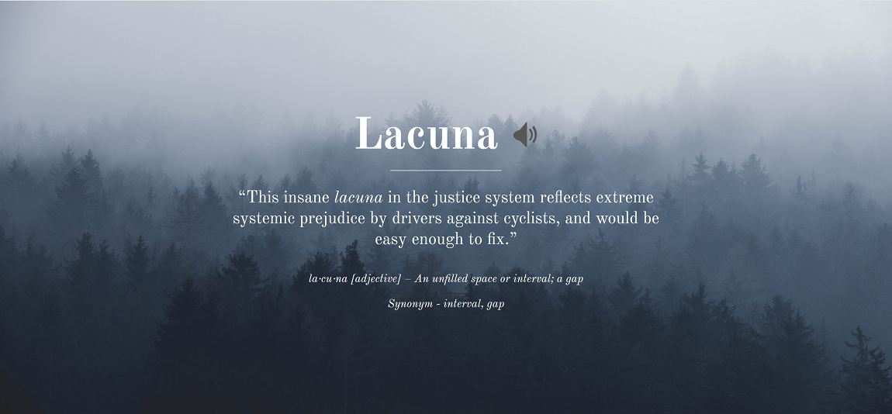

# GRE New Tab Vocabulary Extension

The GRE New Tab Vocab is a browser extension that serves as a learning platform with access to high frequency GRE words. It also includes word's definition, part of speech, sentence usage, synonyms and audio pronunciation. To cap it all, it has a relatable user interface.

# Screenshot

